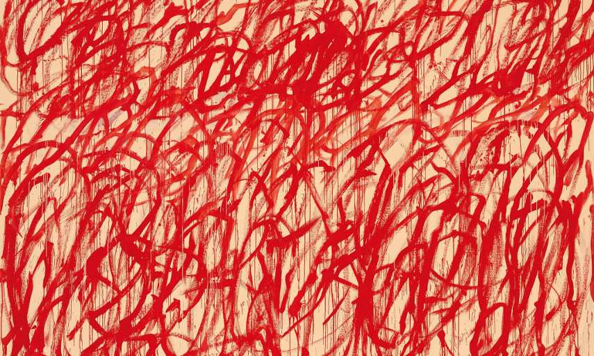

# Gaussian process interactive playground



An interactive demo of a simple gaussian process regression model implemented with d3.js.

## Installation instructions

1. Requires [node.js](https://nodejs.org) to run

2. In the terminal do:
```
git clone https://github.com/aybchan/gaussianprocess
cd gaussianprocess
npm install
npm start
```

3. Open http://localhost:3000 in your browser

## Playground instructions

The canvas is populated with draws from the gaussian process prior distribution (green), some initial observations (blue) and the gaussian process posterior (red) conditioned on this data. Click on the canvas to add a new observation, this will appear as a cyan dot.the GP posterior samples will update to reflect the incorporation of new observations in the GP model. The GP posterior mean and the band of uncertainty (posterior mean ± 2σ—the black lines) will also update.

The configuration of the playground can be changed in public/javascripts/app.js.

